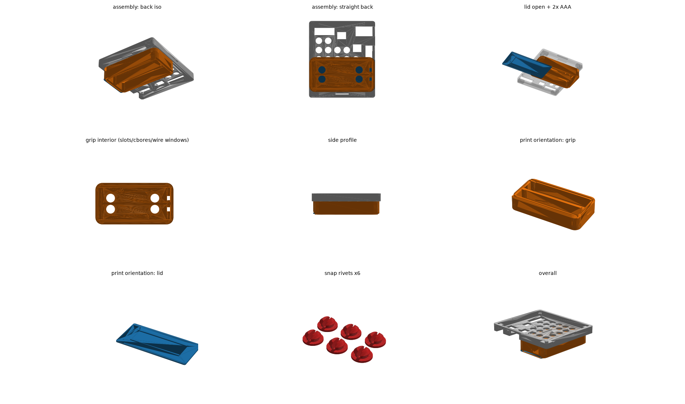

# Rabbit Pie 単4×2 電池グリップモジュール

[Rabbit Pie](https://okikata.org/rp/index.html) の背面ケース
(`case_fix_2026.stl`) に、**単4電池2本（直列 3V）を内蔵**できるようにする
アドオンです。これまでマジックテープで貼っていた電池ボックスの代わりに、
背面下部へカチッと固定できる「電池室兼グリップ」を追加します。

**元のケース STL は無改造のまま**使います。ケース背面にもともと開いている
Φ6mm の軽量化穴をスナップリベットの固定穴として利用するため、
手持ちの印刷済みケースにもそのまま後付けできます。



## 特長

- **単4×2本を直接搭載** — 市販の電池ボックス用電極（バネ/平板）を
  スロットに差し込むだけ。電池交換はスライド蓋から
- **グリップ形状** — 背面下部の膨らみ（張り出し 15.7mm）が
  ゲーム機として握ったときの指置き・パームレストになる。
  外周は大きめの角丸＋45°面取りで手当たりを柔らかく
- **量産向き** — 全部品サポート不要・平置き印刷。
  ケース本体の印刷方法は従来と一切変わらない
- **着脱可能** — リベットを外せば元のフラットな背面に戻せる

## 部品構成

| ファイル | 説明 | 印刷姿勢 |
|---|---|---|
| `stl/case_fix_2026_original.stl` | 元の背面ケース（無改造・参照用） | 従来どおり背面を下 |
| `stl/battery_grip.stl` | 電池室兼グリップ本体 58×30.8×15.7mm | そのまま（合わせ面が下） |
| `stl/battery_lid.stl` | スライド蓋（ディテント付き） | そのまま（外面が下） |
| `stl/snap_rivet_x6.stl` | 固定用プッシュリベット ×6（使用4＋予備2） | そのまま（頭が下） |

## 印刷設定の目安

- 材料: PLA / PETG（リベットは粘りのある PETG 推奨。PLA でも可）
- レイヤー: 0.2mm、壁 3周、インフィル 15% 程度
- サポート: **不要**（全部品）
- 蓋がきつい/ゆるい場合は `generate_battery_grip.py` の `LID_CLR` を調整

## 必要な市販部品

- 電池ボックス用電極（単4/単3 用の金具。幅 ~9.5–10mm・高さ ~12mm 前後の
  一般的なもの。秋月電子・千石電商などで入手可）
  - マイナス側バネ電極 ×1（リード線ハンダ付け）
  - プラス側平板電極 ×1（リード線ハンダ付け）
  - 2本連結用ブリッジ電極 ×1（無ければ単体電極2枚を銅線で接続）
- リード線 2本（AWG24–26、長さ 10cm 程度）

## 組み立て

1. **電極の取り付け** — グリップの左右端にある縦スロットへ電極を
   差し込む。リード線側（単体電極2枚）は配線窓のある側、
   ブリッジ電極は反対側。電池室の床に **＋／－の刻印** があるので
   向きを合わせる
2. **配線** — リード線を電極にハンダ付けし、床の**配線窓**から外へ出す。
   窓はケースの既存 Φ6 穴の真上に来るので、そのままケース内部の
   電源入力（これまで電池ボックスを繋いでいた場所）へ届く
3. **グリップの固定** — グリップをケース背面下部に合わせる
   （4つのリベット穴が既存の Φ6 穴と一致する）。
   電池室の内側からリベットを4本差し込み、押し込んでパチンと固定。
   リベット頭は座ぐりに沈むので電池と干渉しない
4. **電池を入れて蓋を閉める** — 蓋は挿入口（配線窓側の端）から
   スライドさせる。閉じ切るとディテントでカチッと固まる

外すときは、ケース内側からリベット先端をつまんで押し出すか、
グリップをゆっくり引き剥がします。

## 設計データ

`generate_battery_grip.py` がすべての STL を生成するパラメトリックな
ソースです。寸法は冒頭の定数で変更できます:

```bash
pip install numpy trimesh manifold3d shapely
python3 generate_battery_grip.py
```

主な設計値:

| 項目 | 値 |
|---|---|
| 電池チャンネル | 幅 11.6mm × 2、電極面間 48.0mm、深さ 11.5mm |
| 電極スロット | 幅 10.8 × 厚 1.0mm、床へ 1.0mm 食い込み（高さ ~12.5mm の電極まで対応） |
| リベット固定穴 | ケース実測 (−15.40, −9.54) (18.20, −9.51) (−15.40, −17.94) (18.20, −17.91) |
| 配線窓 | ケース既存穴 (−23.77, −9.48) (−23.77, −17.97) の直上 |
| 背面からの張り出し | 15.7mm（本体と合わせた総厚 約24.6mm） |

## 検証済み事項

- 全 STL は watertight（マニフォールド）
- 蓋のスライド全域でグリップと干渉なし（ディテントの乗り越え 0.14mm³ のみ）
- 単4セル（Φ10.5×44.5）2本が蓋・本体と干渉なく収まる
- リベット先端のケース内突出は約 2.2mm — 基板下面（内側 +1.92mm）まで
  2.7mm 以上のクリアランスあり

## 参考リンク

- Rabbit Pie 公式: https://okikata.org/rp/index.html
- 組み立てガイド: https://okikata.org/rp/build.html
