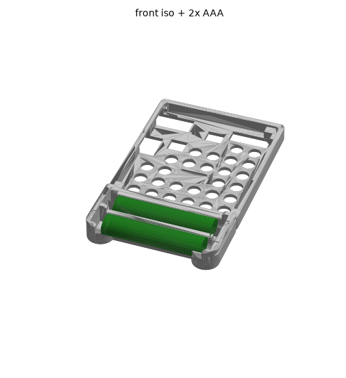

# Rabbit Pie 単4×3 電池内蔵ケース（一体型、2バリエーション）

[Rabbit Pie](https://okikata.org/rp/index.html) の背面ケース
(`case_fix_2026.stl`) を改造し、下端を延長して **単4電池3本（直列 4.5V）を
そのまま搭載できる電池バーを一体化**したケースです。これまでマジック
テープで貼っていた、スイッチ付き単4×3本の電池ボックスは不要になります。

**2つのバリエーション**を用意しています。用途に応じて選んでください。

| バリエーション | ファイル | 内容 |
|---|---|---|
| **BASIC** | `stl/case_3AAA_basic.stl` | 電池3本 + ON/OFF電源スイッチのみ。コンパクト（59.6×125.5×13.3mm） |
| **SPEAKER** | `stl/case_3AAA_speaker.stl` + `stl/speaker_lid.stl` | 電池3本 + 電源スイッチ + ミュートスイッチ + スピーカー（着脱式リッド、別部品）。（59.6×130.0×13.3mm） |


BASIC は追加の印刷部品ゼロ（蓋なし・リベットなし・ネジなし）。
SPEAKER はスピーカー用の着脱式リッドのみ追加印刷が必要です
（スピーカーを本体に恒久的にフリクションフィットさせるのではなく、
着脱できるようにするため。詳細は下記「スピーカーの取り付け」参照）。

## 設計のポイント（共通）

- **蓋のいらないスナップ保持** — 乾電池ホルダーと同じ方式で、チャンネル壁が
  電池を約220°包み込み、開口を電池径より 0.3mm 絞ってパチンと保持。
  電池はバネ側へ押し込んでから持ち上げれば外せる
- **3本ジグザグ直列配線** — 隣り合う電池を交互に逆向きに挿入し、
  両端2箇所のブリッジ電極で接続。外部へ出るのは残り2端（リード線側）だけ
- **印刷方法は従来と同一** — 電池バーの背面はケース背面と同一平面。
  これまでどおり背面を下にした平置き・サポート不要で印刷できる
  （造形高さ 13.3mm）
- **持ちやすい** — Game Boy 風の縦長シルエット。電池の丸い膨らみと
  45° 面取りした両端タワーがパームレスト／指がかりになる
- **元の機能はそのまま** — PCB を留める四隅ポスト・スナップ爪・
  USB 切り欠き・軽量化穴はすべて無改造

## SPEAKER バリエーションの追加要素

- **ON/OFF電源スイッチ**（左タワー上部）＋**スピーカー用ミュートスイッチ**
  （右タワー上部、電源スイッチと対称の設計）。どちらも実測12×5mm程度の
  市販小型スライドスイッチを想定、外側からボディごとフリクションフィット
- **スピーカー用ポケット**（バー中央部、27×17mm程度の楕円形マイクロ
  スピーカーを想定）＋**着脱式リッド**（別部品、グリル穴付き）。
  スピーカーは深いポケットに差し込み、リッドを浅いリベート（額縁状の
  段差）にスナップインして固定する。上下端は薄い保持リップの下に
  滑り込む段付き形状になっており、リッドを外せばスピーカーを
  交換・メンテナンスできる

### なぜリッドを別部品にしたか

スピーカー本体を印刷済みの硬いプラスチックに直接フリクションフィット
させると、コーン紙を傷めたり保持が不安定になりやすいため、**スピーカー
本体は緩めの深いポケットに収め、薄い着脱式リッド（グリル穴付き）だけを
スナップインで固定する**方式にしました。リッドは軽量な平板なので
フリクションフィットでも壊れにくく、着脱してスピーカーの交換もできます。

### イヤホン検出について（重要）

Rabbit Pie のイヤホンジャックの足を確認したところ、**2極しか配線されて
おらず、挿入検知用のスイッチ機構が無い**（先端の接点も常時導通）ことが
分かりました。そのため「イヤホン未挿入時だけ自動でスピーカーが鳴る」機能は、
ジャック交換や基板改造なしには実現できません。

このケースでは代わりに、**右タワー上部の手動ミュートスイッチ**で
イヤホン使用時にスピーカーを手動で切る運用にしています。基板・ジャックは
無改造のままです。

## ファイル

| ファイル | 説明 |
|---|---|
| `stl/case_3AAA_basic.stl` | BASIC: 印刷するのはこれ1個 |
| `stl/case_3AAA_speaker.stl` | SPEAKER: ケース本体 |
| `stl/speaker_lid.stl` | SPEAKER: スピーカー用着脱式リッド（追加印刷） |
| `stl/case_fix_2026_original.stl` | 元の背面ケース（参照用） |
| `generate_battery_case.py` | パラメトリック生成スクリプト（両バリエーション+リッドを一括生成） |

## 印刷設定の目安

- 材料: PLA / PETG
- 姿勢: 背面（平らな面）を下。**従来のケースと同じ**。リッドも印刷面を下に
  したまま出力される向きで生成済み
- レイヤー 0.2mm、壁 3周、インフィル 15%、サポート不要（全部品）
- 電池がきつい/ゆるい場合は `CELL_FIT`（チャンネル径の余裕）と
  `SNAP_PINCH`（開口の絞り量）を調整して再生成



## 電池の配線（ジグザグ直列）

3本を直列にするため、隣り合う電池は**交互に逆向き**に挿入する（一般的な
単3/単4×3本ホルダーと同じ「Z字」配線）。タワー上面の **＋／－ 刻印**で
向きを確認できる。

| チャンネル | x+ タワー | x- タワー |
|---|---|---|
| ch1（ケースに近い側） | ＋（ch1-ch2 ブリッジへ） | −（外部リード線） |
| ch2（中央） | −（ch1-ch2 ブリッジへ） | ＋（ch2-ch3 ブリッジへ） |
| ch3（最下段） | ＋（外部リード線） | −（ch2-ch3 ブリッジへ） |

- x+ タワー: ch1-ch2 ブリッジ電極 + ch3 単体リード線電極
- x- タワー: ch1 単体リード線電極（→電源スイッチ） + ch2-ch3 ブリッジ電極

## 必要な市販部品

**注意:** 秋月電子は基本的に「プラスチックケース＋バネ＋リード線」が一体になった
**完成品の電池ボックス**しか扱っておらず、バネ端子だけを裸で単体販売している
コーナーはありません。入手方法は以下のどちらかになります。

### 方法A: 使用中の電池ボックスから端子とスイッチを移植（もっとも簡単・確実）

今お使いの単4×3本・スイッチ付き電池ボックスをそのまま分解し、
中のバネ端子・平板端子・ブリッジ電極・スライドスイッチを取り出して流用する。
リード線が最初からハンダ付けされているのでそのまま使える。

### 方法B: バラの電池ばね端子を部品として買う

「電池ばね 板ばねタイプ」というカテゴリで、株式会社**アキュレイト**製が
MISUMI・モノタロウ・Amazon で購入できる（例: 型番 BS507 = 単3用マイナス極）。
単4(AAA)専用の型番はメーカーサイトの一覧で要確認:
https://www.accurate.jp/products_category/battery_sp_flat/
型番ごとに極性（＋/－）・電池サイズが決まっているため、
購入前に単4対応であることを型番表で確認すること。

### 電極スロットが受け入れる実寸（型番によらず、これに収まればOK）

| 部位 | 上限 | 意味 |
|---|---|---|
| 差し込みタブ幅 | 9.6mm | タワー上部の縦スロット幅 |
| 差し込みタブ厚み | 1.0mm | スロットの隙間（板厚がこれ以下） |
| 差し込み深さ | 12.5mm | タワー上端〜床下0.8mmまでの通し穴長さ |
| タブ背後のふくらみ逃げ | +2.0mm | バネのコイル部・ハンダ端子折り返し用ポケット |
| 接点面同士の間隔 | 48.0mm | 電池(44.5mm) + バネ圧縮代3.5mm相当 |

一般的な単3/単4兼用の板ばね端子（幅9mm前後、板厚0.3〜0.5mm、
コイル部径Φ8前後）であれば、ほぼ確実にこの範囲に収まる。

### フォークプロング付きタブへの対応

根元に小さな2本足のフォークプロングが付いた実測 20mm×9mm×0.3mm
（コイルばね一体型）のようなタブにも対応。タワー外壁に貫通スリット
（幅6mm×高さ5mm）を設けてあるので、電極を差し込んだ後、根元のプロングを
外へ突き出し、外面の浅い座ぐりに沿って折り曲げればロックできる。
現物の実測値（幅・厚み・プロング位置）が分かれば `generate_battery_case.py`
の `SLOT_W` / `SLOT_T` / `PRONG_SLOT_W` などをその値に合わせて再生成できる。

### ON/OFFスイッチの取り付け（電源・ミュート共通）

左タワー上部（電源用）・右タワー上部（ミュート用、SPEAKERのみ）に、
外側からボディごと差し込むフリクションフィット式のポケットを用意
（`SWITCH_L`=13mm × `SWITCH_H`=5.6mm × `SWITCH_D`=4.6mm、実測12×5mm程度の
スイッチを想定）。ガタつく場合は少量の接着剤（グルーガン等）で固定する
とよい。ポケット寸法が実物と合わない場合は `SWITCH_L` / `SWITCH_H` /
`SWITCH_D` を実測値に合わせて再生成すること。

### スピーカーとリッドの取り付け（SPEAKERのみ）

1. スピーカー本体（27×17mm程度、厚み~4mm）をバー中央部の深いポケット
   （`SPK_HW`×2 × `SPK_HH`×2 × `SPK_BODY_D`）に差し込む
2. `speaker_lid.stl` を印刷し、グリル穴が前面を向くようにして浅いリベートへ
   はめ込む。上下端が薄くなっている段付き形状が、ケース側の保持リップの
   下に滑り込んでスナップインする
3. 外すときはマイナスドライバー等でリッドの縁を軽くこじって持ち上げる

ポケット寸法が実物のスピーカーと合わない場合は `SPK_HW` / `SPK_HH` /
`SPK_BODY_D` を実測値に合わせて再生成すること（リッドも連動して再生成される）。

### 部品リスト

| 部品 | BASIC | SPEAKER |
|---|---|---|
| マイナス側バネ電極 | ×1 | ×1 |
| プラス側平板電極 | ×1 | ×1 |
| 2本連結ブリッジ電極 | ×2 | ×2 |
| ON/OFFスライドスイッチ（電源） | ×1 | ×1 |
| ON/OFFスライドスイッチ（ミュート） | - | ×1 |
| 小型スピーカー（27×17mm程度） | - | ×1 |
| リード線（AWG24–26、数本） | ○ | ○ |

## 組み立て（共通）

1. **電極を差す** — 電極タワーの縦スロットに電極を上から差し込むだけ。
   タワー上面の **＋／－ の刻印** を見ながら、上表のとおりブリッジ電極
   ２箇所（x+ 側 ch1-ch2 / x- 側 ch2-ch3）と、単体リード線電極2箇所
   （x- 側 ch1 / x+ 側 ch3）を配置する
2. **電源スイッチを差す** — 左タワー上部のポケットに外側からスイッチ本体を
   フリクションフィットで押し込む
3. **（SPEAKERのみ）ミュートスイッチとスピーカーを取り付ける** — 右タワー
   上部にミュートスイッチ、バー中央にスピーカー＋リッドを上記の手順で
4. **配線** — ch1（x- 側、外部リード線）からの配線を電源スイッチへ、
   もう一方の端子から配線レースウェイ（タワー内の連続した溝）を通して
   ケース底壁の**貫通トンネル（左）**からケース内部へ。ch3（x+ 側、
   外部リード線）はレースウェイを通して**貫通トンネル（右、SPEAKERのみ）**
   から直接ケース内部へ。（SPEAKERのみ）スピーカーの配線もミュート
   スイッチ経由で左トンネルへ。これまで電池ボックスを繋いでいた電源
   入力へ接続する
5. **電池を入れる** — 上（前面側）からパチンと押し込むだけ。ジグザグ配線
   なので、隣り合う電池は交互に逆向きに入れる。外すときはバネ側へ押して
   から端を持ち上げる

## 設計データ

```bash
pip install numpy trimesh manifold3d shapely
python3 generate_battery_case.py [元ケースSTL]
```

実行すると `stl/case_3AAA_basic.stl`・`stl/case_3AAA_speaker.stl`・
`stl/speaker_lid.stl` が一括生成されます。

主な寸法:

| 項目 | 値 |
|---|---|
| チャンネル | Φ10.9（単4 Φ10.5 + 0.4）×3、ピッチ 12.8mm、電極面間 48.0mm |
| スナップ開口 | 10.2mm（0.3mm 絞り）、リップ包み込み角 約221° |
| 電極タワー | 高さ z=9.33（電極高さ 12.5mm まで収容）、上面 45° 面取り |
| スイッチポケット | 13.0(Y)×5.6(Z)×4.6(X)mm、外側フリクションフィット |
| スピーカーポケット | 30.0(X)×18.0(Y)×4.5(Z)mm 深さ、着脱式リッド式 |
| 配線トンネル | 左 x −19〜−16（共通）／ 右 x 16〜19（SPEAKERのみ）、z −2.8〜−0.6 |

## 検証済み事項

- 出力 STL のメインシェルは watertight（ポスト・爪は元 STL のまま同梱。
  元ファイルにもともと含まれる1つの小さなクリップ形状のみ非watertight
  だが、これは無改造の元データ由来で従来から変わらない）
- 装着状態の単4セル3本（Φ10.5×44.5）はケースと干渉ゼロ（両バリエーション）
- 電源・ミュートスイッチ本体、スピーカー本体（27×17×4mm）の外形ブロックと
  ケースの干渉ゼロ
- スピーカーリッドの段付き形状がケース側の保持リップと正しく重なって
  固定される（リッド自体はリベート内で干渉ゼロ、保持リップとの重なりで
  抜け止めが機能）ことを確認
- 配線トンネル・ダクトは連続して開通していることを確認
- **電極スロット6箇所すべて**（左右タワー×ch1/ch2/ch3）が、各チャンネルの
  実際の電池位置と正しく重なって開通していることをボクセル単位で確認済み
  （過去に x+ タワーの ch1-ch2 ブリッジスロットがチャンネル位置とズレて
  塞がっているバグがあったが、`slot_cut`/`pocket_cut` のY座標ソート漏れを
  修正して解消）

## 参考リンク

- Rabbit Pie 公式: https://okikata.org/rp/index.html
- 組み立てガイド: https://okikata.org/rp/build.html
